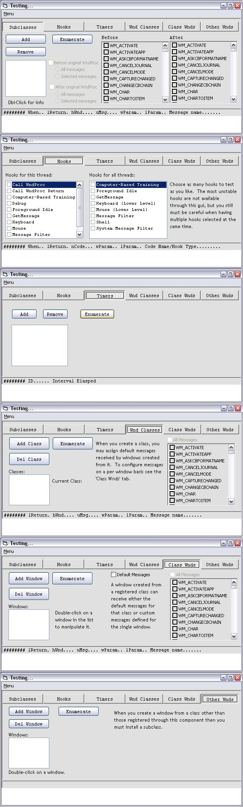



## vbBase Dll

### Description

vbBase. So named because it is the foundation of all my best projects. It encapsulates all the details involved in subclasses, windows hooks, api timers, registered classes, vtable subclassing such as the iEnumVARIANT interface for for .. each enumeration and iOleInPlaceActiveObject, iPerPropertyBrowsing, and iOleControl for building powerful usercontrols.
 
### More Info
 

             |
---                |---
**Submitted On**   |2005-02-21 15:56:50
**By**             |[selftaught](https://github.com/Planet-Source-Code/PSCIndex/blob/master/ByAuthor/selftaught.md)
**Level**          |Advanced
**User Rating**    |5.0 (25 globes from 5 users)
**Compatibility**  |VB 6\.0
**Category**       |[Miscellaneous](https://github.com/Planet-Source-Code/PSCIndex/blob/master/ByCategory/miscellaneous__1-1.md)
**World**          |[Visual Basic](https://github.com/Planet-Source-Code/PSCIndex/blob/master/ByWorld/visual-basic.md)
**Archive File**   |[vbBase\_Dll1856112212005\.zip](https://github.com/Planet-Source-Code/selftaught-vbbase-dll__1-59082/archive/master.zip)

